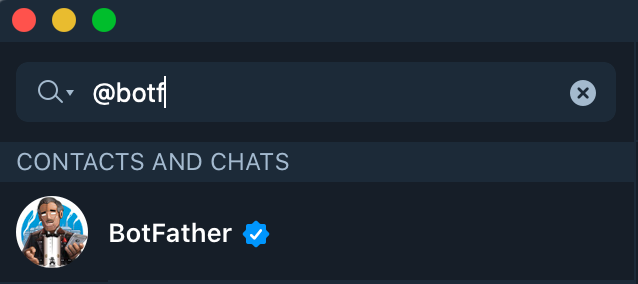
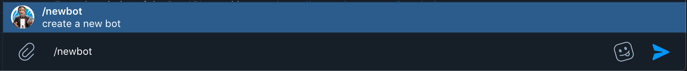
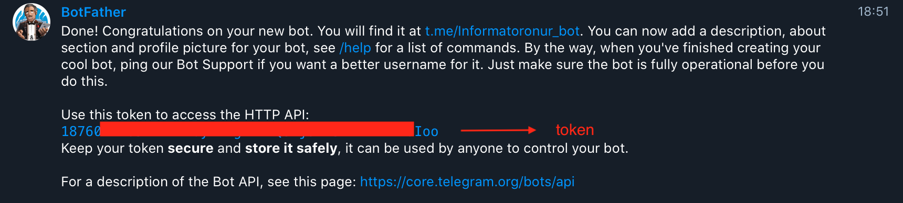

# Web-Monitor
Turkish Gymnastics Federation course announcements tracking application

A simple website monitoring script. If the followed course comes to the list, 
a message is sent automatically with the registration link to the previously created telegram group.

## How to setup telegram bot and the group for automated messages?

* first go the the telegram app and search for "@botfather":
<!-- { width=50% } -->

* Write "/newbot" to create new bot and choose a new name and also an user name for the new bot.

* After that store access token for the bot to able to send automated messages.

* Also invite the bot to the desired telegram group.